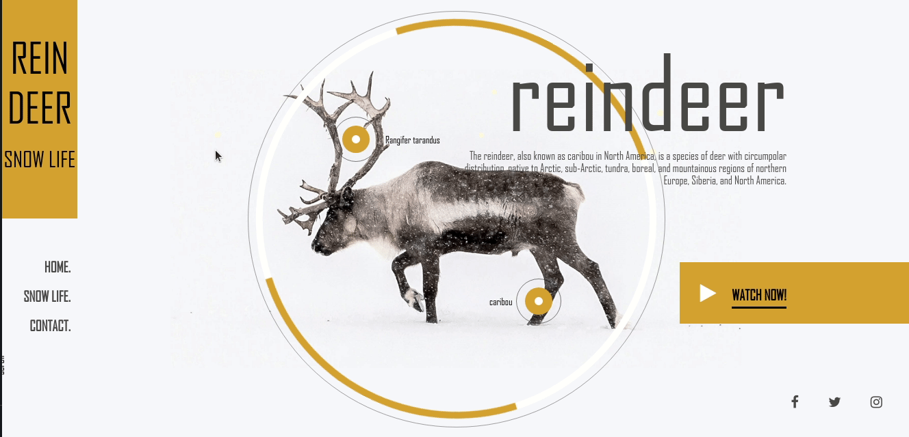

# Reindeer

Reindeer is a clone of the reindeer landing page by [Codicts](https://github.com/codicts) as
designed by [Trion Design](https://dribbble.com/trionndesign)

> ## Built With

- Major languages: HTML5, CSS, Javascript
- Tools/Technologies: GSAP, SCSS, Webpack

> ## Live Demo

[Link Github Repo](https://github.com/dekunleroy/reindeer-landing)

[Site Link](https://reindeer-landing.netlify.app)

> ### Getting Started

To get a local copy up and running follow these simple example steps.

## Prerequisites

1. Vs code

2. NodeJs (Bash/Z shell)

## Setup

Setup by following the installation instructions below

## Install

Run this npm package to install dependencies

- yarn

## Start dev environment

Run this npm package to install dependencies

- yarn start

## Authors

👤 **Segun**

- GitHub: [@dekunleroy](https://github.com/dekunleroy)
- Twitter: [@sublimeaker](https://twitter.com/sublimeaker)
- LinkedIn: [sadebanjo](https://www.linkedin.com/in/sadebanjo/)

## 🤝 Contributing

Contributions, issues, and feature requests are welcome!

Feel free to check the [issues page](https://github.com/dekunleroy/reindeer-landing/issues/).

## Show your support

Give a ⭐️ if you like this project!

## 📝 License

This project is [MIT](https://mit-license.org/) licensed
